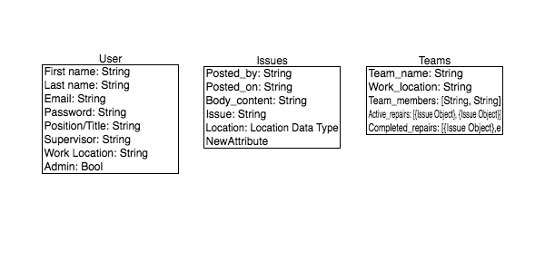

# FIX MY CITY

An app integrated with Twitter to allow citizens to report damage in their city.

## User Story

Fix my city is an app for government employees to use to track and assign damage reported around a given city. Damage is reported via Twitter by everyday citizens. The goal is to encourage people to be active in maintaining their cities and communities.

### Government Employee

Government employees will be the main user of the app.

### Citizen

Will need standard format for posts:
  * Image (not required)
  * Body Content
    * What needs repair
    * Severity ratingß

## Design

  * [Wireframes](https://www.fluidui.com/editor/live/)
  * [Color Palette](https://coolors.co/f5f5f5-dbdbdb-5595cd-f7af8a-ffd08d)
  * [Inspiration](https://c2.staticflickr.com/4/3485/3761059311_68f6ba825c_b.jpg)

## Entity Relationship Diagram

## Technology/Libraries Used

_Server (will be doing server-side routing)_

  1. Server Packages
    * Node.js
    * Express
    * MongoDB
    * Mongoose
  2. Packeges
    * Twitter ([Twitter API](https://github.com/desmondmorris/node-twitter))
    * Google Map React ([Google Maps API](https://www.npmjs.com/package/google-map-react))
